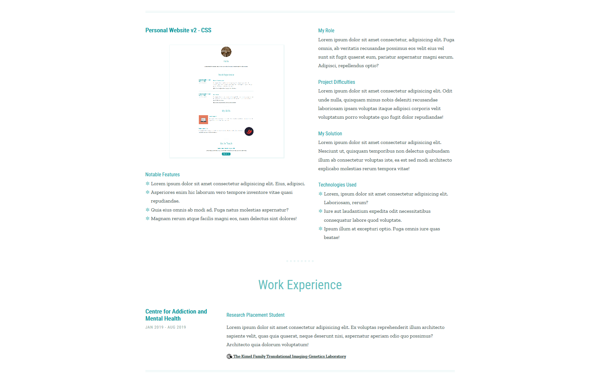
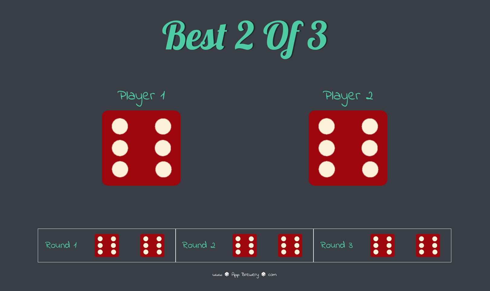

# Angela Yu - The Complete 2021 Web Development Bootcamp

This repository is to track my progress as I work through [The Complete 2021 Web Development Bootcamp](https://www.udemy.com/course/the-complete-web-development-bootcamp/) by Angela Yu on Udemy.com. I will be working on this course in conjunction with [The Web Developer Bootcamp 2021](https://www.udemy.com/course/the-web-developer-bootcamp/) by Colt Steele, also on Udemy.

Start Date: December 2020

## Checklist

- [x] [Personal Website - HTML](#personal-website---html)
- [x] [Personal Website - CSS](#personal-website---css)
- [x] [TinDog](#tindog)
- [x] [Dicee Game](#dicee-game)
- [x] [Drum Kit](#drum-kit)
- [x] [The Simon Game](#simon-game)
- [ ] Calculator
- [ ] BMI Calculator
- [ ] Bitcoin Ticker
- [ ] Newsletter Signup
- [ ] Wiki API 
- [ ] TodoList V1
- [ ] Blog Website V1
- [ ] Fruits
- [ ] TodoList V2
- [ ] Blog Website V2
- [ ] Secrets
- [ ] Registration Screen
- [ ] Real Time Clock
- [ ] Emojipedia
- [ ] TodoList V3
- [ ] Keeper

## Completed Projects

### [Personal Website - HTML](https://mmanogaran.github.io/web-dev-angela-yu/01-personal-site-html/index.html)

A basic personal website filled with some dummy data made using only HTML. Unfortunately, this meant needing to use tables to format everything for now.

#### Modifications
- Included use of semantic HTML
- Reformated "Work Experience" section
- Replaced "Books and Teaching" and "Skills" sections with "Projects" and "Papers" section

  

### [Personal Website - CSS](https://mmanogaran.github.io/web-dev-angela-yu/02-personal-site-css/index.html)

A basic personal website filled with some dummy data made using only HTML and CSS.

#### Modifications
- Converted to SASS for better organization
- Made site mobile-first responsive
- Added a "Work Experience" section that uses CSS Grid for its two column desktop layout
- Added a "Projects" section that uses CSS Flexbox for its two column desktop layout

  

### [TinDog](https://mmanogaran.github.io/web-dev-angela-yu/03-tindog/index.html)

A basic website made using Bootstrap v4.

  

### [Dicee Game](https://mmanogaran.github.io/web-dev-angela-yu/04-dicee-game/index.html)

A website that uses JS to roll 2 dice and display who got the higher number.

#### Modifications
- Made it responsive
- Added a "best two out of three" feature
  - Uses `setInterval` to roll dice every 3 seconds until there has been 3 rounds without a draw and then declares the winner
  - Displays the dice values for each round underneath main dice

  

### [Drum Kit](https://mmanogaran.github.io/web-dev-angela-yu/05-drum-kit/index.html)

A website where you can use your mouse or keyboard to emulate playing the drums.

#### Modifications
- Used `forEach` instead of loop to add an `EventListener` to all drums
- Used `mouseDown`, `mouseUp`, `keyDown`, and `keyUp` instead of `click`, `keyDown`, and `setTimeout` to play sounds and handle animations

  

### [Simon Game](https://mmanogaran.github.io/web-dev-angela-yu/06-simon-game/index.html)

A web version of the Simon Game using jQuery.

#### Modifications
- Used an object instead of a function to handle sounds

  